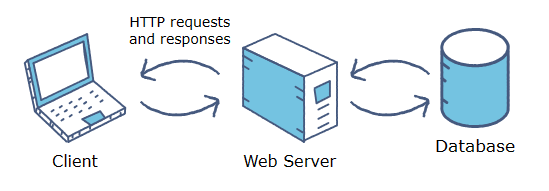
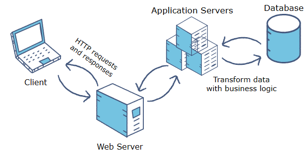
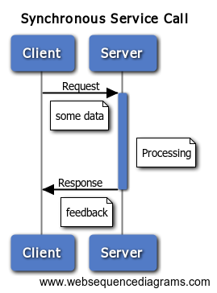
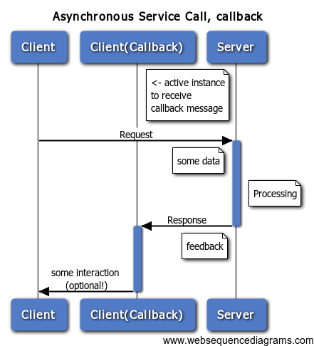
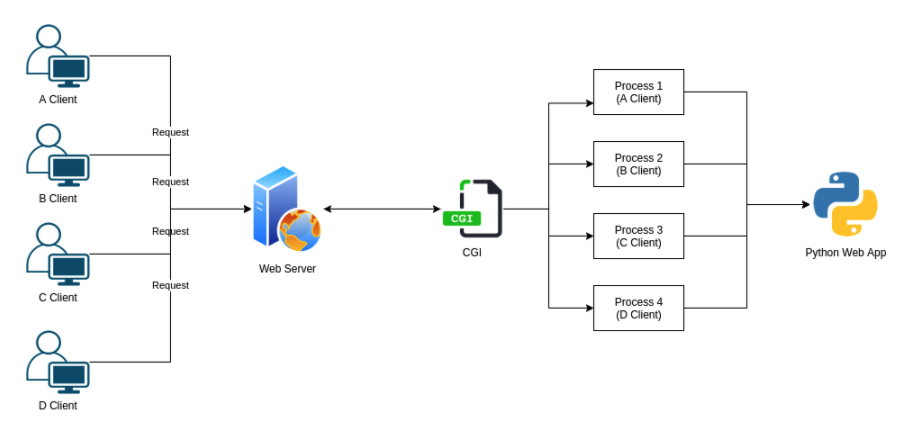
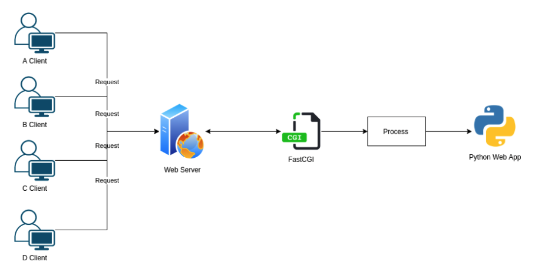
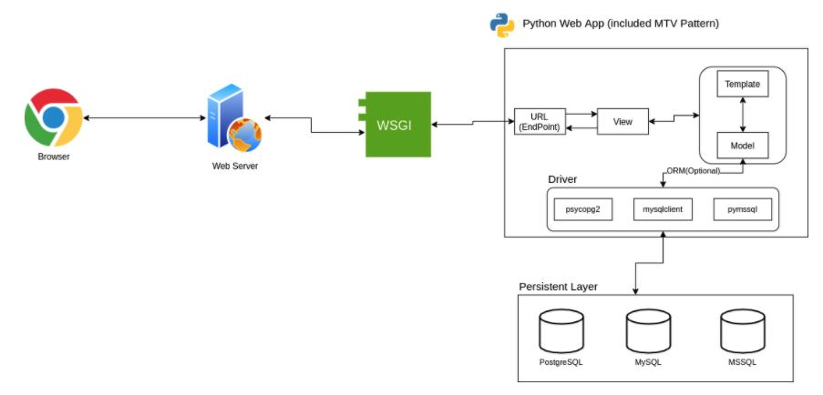
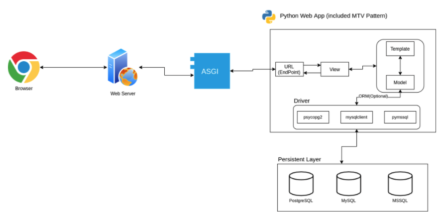

# Part0. synchronous / asynchronous

#### 1. 프로세스와 스레드       

##### 1.1 프로세스    
  - 운영체제로부터 할당받은 자원과 실행 환경을 갖는 독립적인 실행 단위
  - 개별적인 주소 공간을 가지고 있으며 다른 프로세스의 자원에 직접 접근할 수 없음  

<br/>

##### 1.2 스레드
- 하나의 프로세스 내에서 실행되는 여러 실행 경로를 갖는 작은 실행 단위
- 프로세스 내의 주소 공간을 공유하므로 스레드 간에 데이터를 공유하거나 동시에 작업을 수행할 수 있음

<br/>
<br/>

#### 2. 웹 서버 / 애플리케이션 서버
  
##### 2.1 웹 서버
- HTTP 프로토콜을 사용해 클라이언트로부터 HTTP요청을 받고 정적인 웹 컨텐츠(HTML, CSS, 이미지 파일 등)를 제공
- Nginx, Apache HTTP Server, uvicorn, ...




<br/>

##### 2.2 애플리케이션 서버
- 웹 서버의 기능을 확장하여 동적인 웹 애플리케이션을 실행하고 관리
- 데이터베이스 연동, 비니지스 로직처리, 동적 컨텐츠 생성,  세션관리, 트랜잭션 처리 등의 기능을 담당
- 애플리케이션 서버의 클라이언트는 웹 브라우저, 모바일 앱 등이 될 수 있으며 클라이언트-서버 상호작용은 다양한 통신 프로토콜을 통해 이루어 질 수 있다.
- Apache Tomcat, ...
  


  <br/>

  > 💡 웹서버와 애플리케이션 서버의 경계의 모호성
  >
  > -  웹 브라우저가 애플리케이션 클라이언트로 부상하고 웹 애플리케이션과 웹 애플리케이션 성능에 대한 사용자의 기대치가 높아짐에 따라 웹 서버와 애플리케이션 서버간의 경계가 모호해짐
  >
  > - 대분의 웹 서버는 서버측 로직을 기반으로 동적 컨텐츠를 생성할 수 있는 스크립트 언어(ASP,JSP,PHP,Perl)용 플러그인을 지원함.
  >
  > - 점점 더 많은 애플리케이션 서버가 웹 서버 기능을 통합하며 HTTP를 기본 프로토콜로 사용하고 웹 서버와의 인터페이스를 위해 다른 프로토콜(CGI 및 CGI변형)을 지원하고 있다.
  > - 많은 웹 서버와 일부 애플리케이션 서버는 Web Application Server라는 용어를 사용하고 있어 혼란을 가중시키고 있음.

<br/>
<br/>

#### 3. 웹 서버 종류
   
##### 3.1 프로세스 기반 웹 서버
- 클라이언트 요청마다 새로운 프로세스를 생성하여 처리
- 클라이언트 요청이 들어오면 웹 서버는 새로운 프로세스를 생성하고 해당 프로세스가 클라이언트 요청을 처리
- 클라이언트 요청마다 독립적인 프로세스를 할당하므로 안정성은 높지만 프로세스 생성과 관리에 따른 오버헤드 발생
- 고비용의 context switching 발생 (프로세스간의 context switching이 발생하므로 스레드 기반보다 더 많은 오버헤드 발생)
- 예) Apache의 MPM prefork 모델

<br/>

###### 프로세스기반 웹서버 


<br/>

##### 3.2 스레드 기반 웹 서버
- 클라이언트 요청마다 새로운 스레드를 생성하여 처리
- 클라이언트 요청이 들어오면 웹 서버는 새로운 스레드를 생성하고 해당 스레드가 클라이언트 요청을 처리
-  프로세스 내에서 동작하므로 프로세스 간 통신보다는 경량화되며, 프로세스보다 빠른 속도를 제공
-  프로세스 기반 웹서버에 비해 상대적으로 낮은 context switching 발생
- 예) Apache의 MPM worker 모델 

<br/>

###### 스레드기반 웹서버 


<br/>

##### 3.3 이벤트 기반 웹 서버 (비동기서버)
- 단일 스레드에서 비동기 I/O작업과 이벤트 처리를 효율적으로 처리
- Node.js, uvicorn, ...
  
  - Node.js는 단일 프로세스/단일 스레드 기반에서 이벤트 루프 모델을 사용하여 비동기적으로 요청을 처리한다. 단일 스레드지만 다중스레드의 구현을 위해 libuv라는 라이브러리를 사용하며 이 libuv는 uvicorn에서 사용하는 이벤트 루프인 uvloop의 기반이다.
  
  - uvicorn은 기본적으로 단일프로세스/단일스레드 기반에서 asyncio 또는 uvloop을 사용하여 비동기적으로 요청을 처리한다. 단 --workers 옵션을 통해 다중 프로세스 기반으로 동작 가능하게 할 수 있으며 이를 통해 처리량과 확장성을 향상시킬 수 있다.
  
> 💡uvloop와 GIL
> 
> GIL(Global Interpreter Lock)은 CPython(파이썬의 기본 구현체)에서 사용되는 thread-safe를 보장하기 위한 매커니즘으로 하나의 스레드만이 파이썬 인터프리터의 바이트 코드를 실행할 수 있도록 제한하는 잠금 기능이다.
>
> GIL은 파이썬의 메모리 관리를 단순화하고 스레드간의 동시 접근으로 인한 데이터 무결성 문제를 방지하기 위해 도입되었으며 GIL로 인해 하나의 스레드가 파이썬 인터프리터를 독점적으로 사용하게 되므로, 멀티코어 CPU에서 여러 스레드가 병렬(parallelism)로 처리되는것은 불가능하다. 단, 이는 CPU-bound 작업의 경우이며 I/O바운드 작업이나 네트워크 통신과 같은 비동기 작업은 GIL의 영향을 크게 받지 않고 병렬처리를 구현할 수 있다. (이를 우회하는 기법들은 존재)
>
> uvloop는 libuv 기반으로 개발되었지만 Python의 GIL때문에 CPU-bound 작업을 멀티스레드로 처리할 수 없다.
>
> 결국 uvicorn은 GIL로 인해 단일프로세스/단일스레드에서는 CPU성능을 모두 활용하지 못하기 때문에 Node.js처럼 단일스레드로 작동하는게 아닌 Gunicorn등과 함께 사용하여 여러개의 worker프로세스를 생성해서 사용한다. (단, 메모리 사용량이증가하고 context switching에 따른 오버헤드가 발생할 수 있으므로 이를 고려하여 사용여부를 정해야함)
  
<br/>
<br/>

#### 4. 동기 / 비동기

##### 4.1 동기 (Synchronous)
- request가 순차적으로 실행되며 한 request에 대한 처리가 완료될때까지 다음 request는 대기
- 클라이언트의 request를 받은 서버는 해당 request를 처리하기위한 작업을 시작한 후 작업이 완료될 때까지 다음 request를 처리할 수 없음
- 대기시간이 길어질 수 있고 Blocking이 발생할 수 있어 동시성(Concurrency)과 확장성(Scalability)에 제한이 있을 수 있음
- 직렬적으로 처리되기 때문에 하나의 작업이 오래 걸릴 경우 전체 시스템의 응답 시간이 느려질 수 있음

###### 동기처리방식


<br/>

##### 4.2 비동기 (Asynchronous)
- 병렬적으로 실행되며 한 작업이 완료되지 않아도 다음작업을 실행할 수 있음
- 클라이언트의 request를 받은 서버는 해당 request를 비동기적으로 처리하고, 해당 작업이 완료되기 전에도 다른 request를 처리할 수 있음
- Non-Blocking 방식으로 처리되기 때문에, 다중 작업을 동시에 처리할 수 있고 응답시간이 개선될 수 있음
- 작업이 완료되면 콜백 / 프라미스 등을 통해 결과를 처리하거나 이벤트를 발생시킬 수 있다.
- 더 높은 동시성과 확장성을 제공하여, I/O작업이 많은 웹서비스에서 효율적으로 사용될 수 있다.
  
<br/>

###### 비동기 구현방식의 예
| 비동기의 fire and forget방식                                               | 비동기의 polling방식                                                                                                               | 비동기의 callback방식                                                                                                                |
| -------------------------------------------------------------------------- | ---------------------------------------------------------------------------------------------------------------------------------- | ------------------------------------------------------------------------------------------------------------------------------------ |
| 메시지는 전송되나 feedback은 없음                                          | 클라이언트가 서버에 피드백을 반복적으로 요청                                                                                       | 요청수신자(서버)는 올바른 클라이언트 주소를 지정하는 방법을 알고 있어야한다.(request내에 포함되어 전달되거나 정적으로 저장될수 있음) |
|                                                                            | 높은네트워크 부하를 유발하지만 서버가 클라이언트에 대해 알 필요가 없고 클라이언트가 직접 서비스를 제공할 필요가 없다는 장점이 있음 | 피드백을 수집하려면 호출자 측의 일부 활성 인스턴스가 피드백 메시지를 수신하기 위해 수신 대기 중이어야 합니다                         |
| Apache Kafka,RabbitMQ,...  메시지 전송 후 처리결과등을 알 필요가 없는 경우 | Socket.IO, Django Channels, ...                                                                                                    | Node.js, Express.js,...                                                                                                              |  |
|                                           |                                                                                                   |                                                                                                     |

  - FastAPI의 비동기 방식은 async/await를 기반으로 한 Coroutine을 방식을 사용
<br/>
<br/>

#### 5. CGI / FastCGI
##### 5.1 CGI
- CGI (Common Gateway Interface)는 웹 서버와 외부 프로그램 또는 스크립트 간의 상호작용을 위한 표준 인터페이스
- 일반적으로 정적인 컨텐츠는 웹 서버에서 바로 제공되지만, 동적인 웹 페이지는 웹 서버에서 CGI를 사용하여 생성
- 웹 서버와 외부 프로그램 간의 표준화 된 인터페이스를 제공하므로, 특정 웹 서버에 종속되지 않고 다양한 웹 서버와 호환되는 환경에서 동작할 수 있는 플랫폼 독립성을 제공하여 개발자가 자유롭게 웹 애플리케이션을 구축하고 배포할 수 있게 함
- CGI는 클라이언트 요청마다 프로세스를 추가로 생성하고 삭제하는데 (프로세스 기반 웹서버) context switching으로 인한 오버헤드가 발생하고 이 오버헤드는 요청이 많을수록 더 커지게 된다. REST API가 빈번하게 호출되는 현대의 웹 서비스에는 어울리지 않음.

###### CGI


<br/>

##### 5.2 FastCGI
- CGI의 단점인 요청마다 프로세스를 추가로 생성하는 부분을 개선하여 하나의 프로세스로 작업 처리. 즉 메모리에 하나의 프로세스만을 적재하여 재활용하기에 CGI에 비해 오버헤드가 월등하게 감소.

###### FastCGI


<br/>  

#### 6. WSGI / ASGI
##### 6.1.1 WSGI (Web Server Gateway Interface)
- Python 웹 애플리케이션과 웹 서버 간 상호작용을 위한 표준 인터페이스
- Python의 웹 애플리케이션 개발을 표준화하고 효율적인 웹 서버 연결을 위한 목적으로 등장
- FastCGI와 마찬가지로 단일 프로세스로 동작

<br/>


###### WSGI


<br/>

> 💡 WSGI의 두가지 단점
> - 한번에 하나의 요청과 응답만 처리하며 응답이 즉시 반환된다고 전제한다. 웹소켓 또는 long polling http연결과 같이 장시간 지속되는 연결을 처리할 방법이 없다.
> 
> - 동기전용이다. 멀티스레드 연결풀을 사용하더라도 응답이 반환될 때까지 각 연결이 차단된다. 많은 WSGI 설정에 스레드와 프로세스 풀을 처리할 수 있는 기능이 있지만 WSGI 인터페이스 자체가 동기적이라는 점에 의해 제한된다.

<br/>

##### 6.1.2 WSGI의 작동방식
- WSGI는 보통 application 또는 app이라는 이름의 파이썬 함수를 웹서버에 드러낸다.
이 함수는 다음의 두 개매변수를 가진다.
  - environ: 웹 서버가 제공한 환경변수와 현재 요청에 대한 정보가 포함된 dictionary
  - start_response: 클라이언트로 HTTP 응답을 보내기 위해 호출하는 함수
  
    상태코드와 응답헤더를 인자로 받음

##### WSGI에 맞게 구현한 application함수
```python
def application(environ, start_response):
    # 환경 변수에서 요청 정보 추출
    method = environ['REQUEST_METHOD']
    path = environ['PATH_INFO']

    # start_response를 호출하여 상태 코드와 응답 헤더 전달
    start_response('200 OK', [('Content-Type', 'text/plain')])

    # 응답 본문 생성 및 반환
    response_body = 'Hello, World!'
    return [response_body.encode()]
```  

- Flask와 같은 WSGI 호환 웹 프레임워크를 사용하는 경우 프레임워크 자체에서 application함수를 제공하며 이 함수의 모든 구성요소가 자동으로 연결된다.

<br/>
<br/>

##### 6.2.1 ASGI
- Python 비동기 웹 애플리케이션과 웹 서버간의 표준 인터페이스
- WSGI는 기본적으로 동기 동작을 전제하여 만들어진 표준이기에 비동기의 성능이나 효율성이 떨어진다. 웹소켓과 같은 고급 프로토콜을 효과적으로 처리하지 못한다는 뜻.
이에 ASGI가 나왔고 ASGI는 동기 및 비동기를 모두 지원한다.

<br/>

###### ASGI


##### 6.2.2 ASGI의 작동 방식
- 표면적으로 WSGI와 비슷하다. WSGI와 마찬가지로 application 함수 객체를 정의한다.
  다른점은 async 함수이며 매개변수가 2개가 아닌 3개라는 것이다.
  - scope: 현재 요청에 대한 정보가 포함된 dictionary로, ASGI서버가 애플리케이션과 통신할 때 전달되는 데이터. type,headers, method 등
  - send: 애플리케이션이 클라이언트의 request를 처리 후 생성한 response를 웹 서버로 전송
  - receive: 애플리케이션이 클라이언트의 request를 웹서버로부터 수신

###### ASGI에 맞게 구현한 application함수
```python
 async def application(scope, receive, send):
    await send({
        'type': 'http.response.start',
        'status': 200,
        'headers': [
            [b'content-type', b'text/plain'],
        ],
    })

    await send({
        'type': 'http.response.body',
        'body': b'Hello, world!',
    })
```
- application()을 수동으로 구현하여 ASGI웹애플리케이션을 만들 수도 있다. 그러나 대부분의 경우 ASGI 파이썬 웹 프레임워크를 사용하는 편이 더 간편하다. ASGI와 잘 어울리는 대표적인 웹 프레임워크는 다음과 같다.
  - Starlette과 FastAPI: 최근 주목받는 프레임워크로 둘 다 비동기 우선이므로 ASGI를 지원한다. 가장 현대적인 웹 프레임워크이며 FastAPI는 Starlette를 포함한다.
  
  - Django 3.0 이상: 장고는 버전3.0부터 ASGI를 지원한다. 장고 애플리케이션 내의 비동기 코드 지원은 3.1에 추가됐다.실행 속도 측면에서 아쉬운 측면이 있는 프레임워크임을 감안하면 비동기의 활용으로 더 높은 성능을 얻을 수 있다.

- ASGI를 사용할 땐 async함수와 최대한 비동기 친화적인 라이브러리를 사용하는 것이 좋다.

<br/>
<br/>

#### 7. FastAPI에서의 비동기

##### 7.1 FastAPI에서의 비동기 처리
- FastAPI는 동기 / 비동기 처리를 모두 지원한다.

- FastAPI의 비동기는 기본적으로 병렬성(parallelism)이 아닌 병행성(concurrency)이다.
> 💡 병렬성(parallelism)과 병행성(concurrency)
>
> - 병렬성(parallelism)  
>   병렬성은 여러 작업이 실제로 동시에 실행되어 완료될 수 있는 것을 말한다
>   CPU코어가 여러개인 컴퓨터환경이라면 다중 CPU코어를 활용해 작업을 병렬적으로 처리할 수 있다.
>
> - 병행성(concurrency)  
>   여러 작업이 동시에 실행되는 것처럼 보이지만 실제로는 하나의 작업만 
>   실행되며, 실행되는 상태를 빠르게 변경하여 여러일을 마치 동시에 하듯 수행하는 것을 
>   말한다. 
> 
>   C++,Java등에서 여러 스레드를 실행한다는건 프로그램이 동시에 여러 CPU코어를 
>   사용해 각각 스레드가 동시에 실행된다는 것을 의미한다. Python도 멀티 스레드를  
>   지원하지만 GIL제약에 의해 실제로는 한번에 하나의 스레드만 실행하게 되고 다중 
>   CPU코어를 활용해 병렬적으로 실행되는 것이 제약된다.
>   
- 병렬성이 아닌 병행성으로 비동기처리를 하기에 CPU바운드작업(계산집약적작업)에는  
  이점이 없지만 I/O작업(API호출,DB조회 등)에는 대기시간을 최소화하고 응답성을 향상시킬 수 있어 유용하다.

- 비동기 처리를 위해 사용하는 모듈 및 문법들
  - asyncio  
    - FastAPI 내부적으로 asyncio를 사용해 비동기를 처리
    - 비동기 프로그래밍을 위한 핵심 모듈로 코루틴과 이벤트루프를 활용하여 비동기 작업을 처리한다.
      - 코루틴 (Coroutine)
        - 임시 중단 및 재개가 가능한 함수로, 비동기 작업의 일부를 표현
        - 'async' 키워드로 코루틴을 정의하고 'await' 키워드를 사용하여 작업완료를 기다리거나 다른 코루틴을 호출한다.
      - 이벤트 루프 (Event Loop)
        - 작성된 코루틴들을 실행하고 관리한다.
        - 비동기 작업의 상태를 추적하고, 작업이 완료되면 해당 작업을 재개하거나   
          결과를 처리한다.
    - 만약 uvloop을 사용한다해도 asyncio를 사용하지 않는건 아니다. asyncio의 이벤트 루프를 보다 효율적으로 처리하는 것일뿐

  - httpx  
    - 비동기적인 방식으로 HTTP request를 전송하고 response를 받을 수 있음
    - 이를 통해 외부서비스와의 비동기 통신 수행가능
 
  - BackgroundTasks
    - 'BackgroundTasks' 클래스를 사용하여 비동기 작업을 큐에 추가하고 비동기적으로 실행되는 백그라운드 작업을 처리할 수 있다.
  
<br/>


##### 7.3 비동기로 DB 연동하기
  - FastAPI에서 비동기로 DB와 연동하기 위해서는 비동기 지원을 제공하는 데이터베이스 드라이버를 사용해야 한다.
  - 작성중,,,,