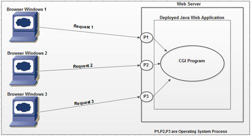
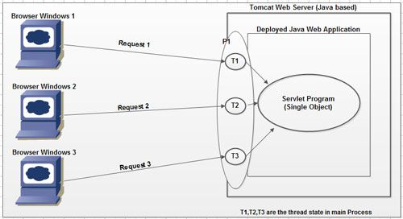
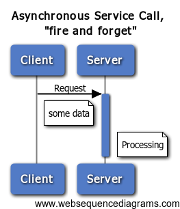
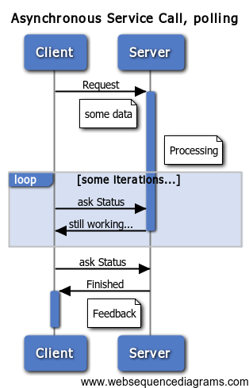

# Part0. 동기 및 비동기

#### 1. 프로세스와 스레드       

##### 1.1 프로세스    
  - 운영체제로부터 할당받은 자원과 실행 환경을 갖는 독립적인 실행 단위
  - 개별적인 주소 공간을 가지고 있으며 다른 프로세스의 자원에 직접 접근할 수 없음  

 

##### 1.2 스레드
- 하나의 프로세스 내에서 실행되는 여러 실행 경로를 갖는 작은 실행 단위
- 프로세스 내의 주소 공간을 공유하므로 스레드 간에 데이터를 공유하거나 동시에 작업을 수행할 수 있음

 

#### 2. 프로세스 기반 웹서버 / 스레드 기반 웹서버 / 이벤트 기반 웹서버(비동기서버)
   
##### 2.1 프로세스 기반 웹 서버
- 클라이언트 요청마다 새로운 프로세스를 생성하여 처리
- 클라이언트 요청이 들어오면 웹 서버는 새로운 프로세스를 생성하고 해당 프로세스가 클라이언트 요청을 처리
- 클라이언트 요청마다 독립적인 프로세스를 할당하므로 안정성은 높지만 프로세스 생성과 관리에 따른 오버헤드 발생
- 고비용의 context switching 발생 (스레드 기반보다 더 많은 비용이 발생한다.)
- 예) Apache의 MPM prefork 모델

 

###### 프로세스기반 웹서버 

 

##### 2.2 스레드 기반 웹 서버
- 클라이언트 요청마다 새로운 스레드를 생성하여 처리
- 클라이언트 요청이 들어오면 웹 서버는 새로운 스레드를 생성하고 해당 스레드가 클라이언트 요청을 처리
-  프로세스 내에서 동작하므로 프로세스 간 통신보다는 경량화되며, 프로세스보다 빠른 속도를 제공
-  프로세스 기반 웹서버에 비해 상대적으로 낮은 context switching 발생
- 예) Apache의 MPM worker 모델 

 

###### 스레드기반 웹서버 

 

##### 2.3 이벤트 기반 웹 서버 (비동기서버)
- 단일 스레드에서 비동기 I/O작업과 이벤트 처리를 효율적으로 처리
- Nginx / Node.js / uvicorn 등. 
Node.js는 싱글 스레드 이벤트 루프 모델을 사용하여 비동기적으로 요청을 처리

 
 

#### 3. 웹 서버 / 애플리케이션 서버
  
##### 3.1 웹 서버
- HTTP 프로토콜을 사용해 클라이언트로부터 HTTP요청을 받고 정적인 웹 컨텐츠(HTML, CSS, 이미지 파일 등)를 제공
- Nginx, Apache HTTP Server, ...

 

##### 3.2 애플리케이션 서버
- 웹 서버의 기능을 확장하여 동적인 웹 애플리케이션을 실행하고 관리
- 데이터베이스 연동, 비니지스 로직처리, 동적 컨텐츠 생성,  세션관리, 트랜잭션 처리 등의 기능을 담당
- 애플리케이션 서버의 클라이언트는 웹 브라우저, 모바일 앱 등이 될 수 있으며 클라이언트-서버 상호작용은 다양한 통신 프로토콜을 통해 이루어 질 수 있다.
- Apache Tomcat, ...
  

   

  > 💡 웹서버와 애플리케이션 서버의 경계의 모호성
  >
  > -  웹 브라우저가 애플리케이션 클라이언트로 부상하고 웹 애플리케이션과 웹 애플리케이션 성능에 대한 사용자의 기대치가 높아짐에 따라 웹 서버와 애플리케이션 서버간의 경계가 모호해짐
  >
  > - 대분의 웹 서버는 서버측 로직을 기반으로 동적 컨텐츠를 생성할 수 있는 스크립트 언어(ASP,JSP,PHP,Perl)용 플러그인을 지원함.
  >
  > - 점점 더 많은 애플리케이션 서버가 웹 서버 기능을 통합하며 HTTP를 기본 프로토콜로 사용하고 웹 서버와의 인터페이스를 위해 다른 프로토콜(CGI 및 CGI변형)을 지원하고 있다.
  > - 많은 웹 서버와 일부 애플리케이션 서버는 Web Application Server라는 용어를 사용하고 있어 혼란을 가중시키고 있음.

#### 4. 동기 / 비동기
##### 4.1 동기 (Synchronous)
- request가 순차적으로 실행되며 한 작업이 완료될때까지 다음 작업은 await
- 클라이언트 요청을 받은 서버는 해당 요청을 처리하기위한 작업을 시작한 후 작업이 완료될 때까지 다음 요청을 처리하지 않음
- 대기시간이 길어질 수 있으며 Blocking이 발생할 수 있어 동시성과 확장성에 제한이 있을 수 있음
- 직렬적으로 처리되기 때문에 하나의 작업이 오래 걸릴 경우 전체 시스템의 응답 시간이 느려질 수 있다.

###### 동기처리방식

 

##### 4.2 비동기 (Asynchronous)
- 병렬적으로 실행되며 한 작업이 완료되지 않아도 다음작업을 실행할 수 있음
- 클라이언트 요청을 받은 서버는 해당 요청을 비동기적으로 처리하고, 작업이 완료되기 전 다른 요청을 처리할 수 있음
- Non-Blocking 방식으로 처리되기 때문에, 다중 작업을 동시에 처리할 수 있고 응답시간이 개선될 수 있음
- 작업이 완료되면 콜백 / 프라미스 등을 통해 결과를 처리하거나 이벤트를 발생시킬 수 있다.
- 더 높은 동시성과 확장성을 제공하여, I/O작업이 많은 웹서비스에서 효율적으로 사용될 수 있다.

| 비동기의 fire and forget방식      | 비동기의 polling방식                                                                                                               | 비동기의 callback방식                                                                                                         |
| --------------------------------- | ---------------------------------------------------------------------------------------------------------------------------------- | ----------------------------------------------------------------------------------------------------------------------------- |
| 메시지는 전송되나 feedback은 없음 | 클라이언트가 서버에 피드백을 반복적으로 요청                                                                                       | 요청수신자(서버)는 클라이언트 주소를 지정하는 방법을 알고 있어야한다.(request내에 포함되어 전달되거나 정적으로 저장될수 있음) |
|                                   | 높은네트워크 부하를 유발하지만 서버가 클라이언트에 대해 알 필요가 없고 클라이언트가 직접 서비스를 제공할 필요가 없다는 장점이 있음 | 피드백을 수집하려면 호출자 측의 일부 활성 인스턴스가 피드백 메시지를 수신하기 위해 수신 대기 중이어야 합니다                  |
|  |                                                                                                   |                                                                                              |

#### 5. FastAPI에서의 동기 / 비동기
- FastAPI는 동기 / 비동기 처리를 모두 지원한다.