# 1. FastAPI 애플리케이션 구조화

#### 1.1 구조화란?
 - 코드의 구조를 조직화하고 모듈화 하는 것
 - 코드의 가독성,유지보수성,재사용성,테스트 용이성 등을 향상시켜 전체적인 생산성을 높임

<br/>

#### 1.2 이벤트 플래너 애플리케이션 구조화
- 아래와 같은 구조로 설계
     
        planner/
            main.py
            database/
                connection.py
            routes/
                events.py
                users.py
            models/
                events.py
                users.py

  - database 폴더
    - connection.py : 데이터베이스 추상화와 설정에 사용되는 파일
  - routes 폴더 
    - events.py : 이벤트 생성,변경, 삭제 등의 처리를 위한 라우팅
    - users.py : 사용자 등록 및 로그인 처리를 위한 라우팅
  - models 폴더
    - events.py : 이벤트 처리용 모델을 정의
    - users.py : 사용자 처리용 모델을 정의

<br/>

#### 1.3 이벤트 플래너 애플리케이션 개발
- 사용자 모델과 이벤트 모델 두가지 모델을 사용한다.
- 사용자 라우팅은 사용자등록, 로그인 두가지 기능을 가진다.
- 이벤트 라우팅은 이벤트생성,단일이벤트조회,전체이벤트조회,이벤트변경,이벤트삭제 기능을 가진다.
- email-validator라는 의존 라이브러리를 사용하므로 설치해주자.
  - pip install fastapi uvicorn "pydantic[email]"

<br/>

##### 1.3.1 모델 구현
- 우선 이벤트 모델과 사용자 모델을 정의하자.
- 각 사용자는 이벤트 필드를 가지며 여러개의 이벤트를 저장할 수 있다. (사용자:이벤트 -> 1:N 관계)
  
  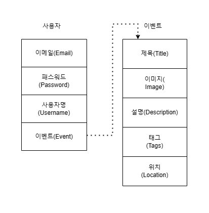

<br/>

- 이벤트 모델(Event)을 models 폴더의 events.py에 정의한다.
  - Event 클래스 안에 Config 서브 클래스를 추가한다.  
    문서화할 때 샘플 데이터를 보여주기 위한 용도.

###### /models/events.py
```python
from pydantic import BaseModel
from typing import List

class Event(BaseModel):
  id: int
  title: str
  image: str
  description: str
  tags: List[str]
  location: str

  class Config:
    schema_extra = {
      "example": {
      "title": "FastAPI Book Launch",
      "image": "https://linktomyimage.com/image.png",
      "description": "We will be discussing the contents of the FastAPI book in this event.",
      "tags": ["python", "fastapi", "book", "launch"],
      "location": "Google Meet"
    }
  }
```

<br/>
<br/>

- 마찬가지로 사용자 모델과 Config를 정의한다.

###### /models/user.py
```python
from pydantic import BaseModel, EmailStr
from typing import Optional, List
from ..schemas.events import Event

class User(BaseModel):
  id: int
  email: EmailStr
  username: str
  password: str
  events: Optional[List[Event]]

  class Config:
    schema_extra = {
      "example": {        
        "email": "jhlee@yescnc.co.kr",
        "username": "jhlee",
        "password": "pwd123!",
        "events": [],
      }
    }
```

<br/>
<br/>

- 사용자 로그인 모델(UserSignIn)을 만든다.

###### /models/users.py
```python
class UserSignIn(BaseModel):
  email: EmailStr
  password: str

  class Config:
    schema_extra = {
      "example": {
        "email": "jhlee@yescnc.co.kr",
        "password": "pwd123!"
      }
    }
```

<br/>

##### 1.3.2 라우트 구현

- 사용자 라우트 설계  
  - prefix /user
  - 등록(/signup), 로그인(/signin), 로그아웃(/signout)
  - 로그인 인증이 완료된 사용자는 이벤트 조회, 생성, 변경, 삭제할 수 있고  
    인증을 거치지 않은 사용자는 이벤트 조회만 가능
- 이벤트 라우트 설계
  - prefix /event
  - 생성(/new), 조회(/, /{id}), 변경(/{id}), 삭제(/{id}) 필요

<br/>

##### 1.3.2.1 사용자 라우트 생성
  
###### /routes/users.py
```python
users = {}
#사용자 등록
@user_router.post("/signup")
async def sign_new_user(data: User) -> dict:
    if data.email in users:
        raise HTTPException(
            status_code=status.HTTP_409_CONFLICT,
            detail="User with supplied email exists"
        )
    users[data.email] = data
    return {
        "message": "User successfully registered"
    }

#사용자 로그인
@user_router.post("/signin")
async def sign_user_in(user: UserSignIn) -> dict:
    if user.email not in users:
        raise HTTPException(
            status_code=status.HTTP_404_NOT_FOUND,
            detail="User does not exist"
        )
    
    if users[user.email].password != user.password:
        raise HTTPException(
            status_code=status.HTTP_403_FORBIDDEN,
            detail="Wrong credentials passed"
        )
    
    return {
        "message": "User signed in successfully"
    }
```

<br/>

###### /main.py
```python
from fastapi import FastAPI
from .routes.users import user_router

app = FastAPI()

app.include_router(user_router, prefix="/user")
```

<br/>

- 사용자 라우트를 작성했으니 정상작동하는지 테스트를 해보자. 사용자 등록부터 해본다.
  
case 1. 정상 등록

| 요청                                  | 응답                                  |
| ------------------------------------- | ------------------------------------- |
|  | 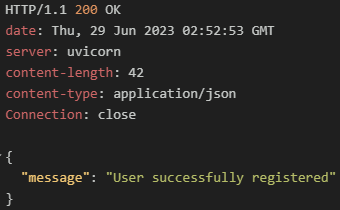 |

<br/>

  
    
  case 2. DB상에 동일한 이메일이 존재할 경우

| 요청                                  | 응답                                  |
| ------------------------------------- | ------------------------------------- |
|  |  |

<br/>

- 정상적으로 등록되었다면 로그인 라우트를 테스트 해본다.

case 1. 정상 로그인

| 요청                                  | 응답                                  |
| ------------------------------------- | ------------------------------------- |
| 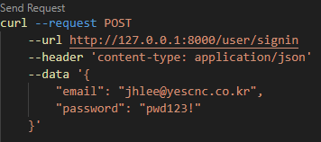 | 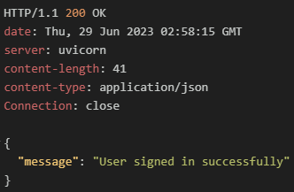 |

<br/>

case 2. 잘못된 패스워드 입력

| 요청                                  | 응답                                  |
| ------------------------------------- | ------------------------------------- |
| 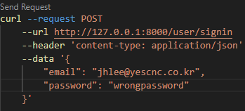 | 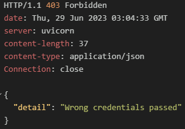 |

  <br/>

case 3. 잘못된 이메일 입력

| 요청                                  | 응답                                  |
| ------------------------------------- | ------------------------------------- |
|  | 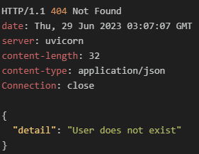 |


##### 1.3.2.1 이벤트 라우트 생성

###### /routes/events.py
```python
from fastapi import APIRouter, Body, HTTPException, status
from ..models.events import Event
from typing import List

event_router = APIRouter(tags=["Events"])
events = []

#모든 이벤트 조회
@event_router.get("/", response_model=List[Event])
async def retrieve_all_events() -> List[Event]:
    return events

#특정 이벤트 조회
@event_router.get("/{id}", response_model=Event)
async def retrieve_event(id: int) -> Event:
    for event in events:
        if event.id == id:
            return event
    raise HTTPException(
        status_code=status.HTTP_404_NOT_FOUND
        detail="Event with supplied ID does not exist"
    )

#이벤트 생성
@event_router.post("/new")
async def create_event(body: Event = Body(...)) -> dict:
    events.append(body)
    return {
        "message": "Event created successfully"
    }

#이벤트 삭제
@event_router.delete("/{id}")
async def delete_event(id: int) -> dict:
    for event in events:
        if event.id == id:
            events.remove(event)
            return {
                "message": "Event deleted successfully"
            }
    raise HTTPException(
        status_code=status.HTTP_404_NOT_FOUND,
        detail = "Event with supplied ID does not exist"
    )

#전체 이벤트 삭제
@event_router.delete("/")
async def delete_all_events() -> dict:
    events.clear()
    return {
        "message": "Events deleted successfully"
    }
```

<br/>

###### /main.py
```python
from fastapi import FastAPI
from .routes.users import user_router
from .routes.events import event_router
import uvicorn

app = FastAPI()

app.include_router(user_router, prefix="/user")
app.include_router(event_router, prefix="/event")
```

<br/>

- 이벤트 라우트를 생성했으니 정상작동하는지 테스트를 해보자. 이벤트 등록부터 해본다.
  
| 요청                                   | 응답                                   |
| -------------------------------------- | -------------------------------------- |
| 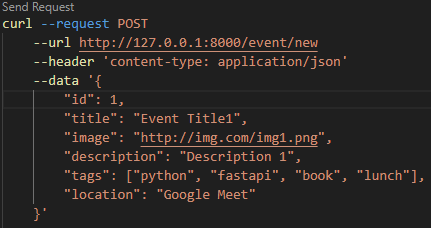 |  |
| 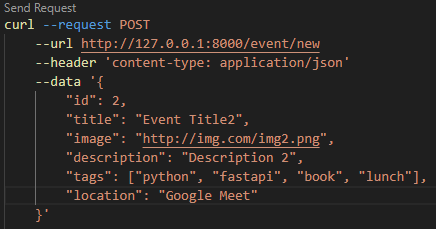 |  |

- 전체 이벤트리스트 확인

| 요청                                   | 응답                                   |
| -------------------------------------- | -------------------------------------- |
|  |  |

- 특정 이벤트 확인

| 요청                                   | 응답                                   |
| -------------------------------------- | -------------------------------------- |
|  |  |

- 특정 이벤트 삭제  

case 1. 정상삭제
  
| 요청                                   | 응답                                   |
| -------------------------------------- | -------------------------------------- |
|  | 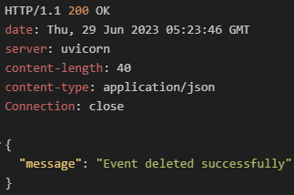 |
  
case 2. 없는 ID로 삭제 요청

| 요청                                   | 응답                                   |
| -------------------------------------- | -------------------------------------- |
|  | 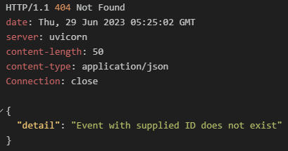 |

<br/>

- 제대로 삭제 되었는지 전체 이벤트 리스트 다시 확인

| 요청                                   | 응답                                   |
| -------------------------------------- | -------------------------------------- |
|  | 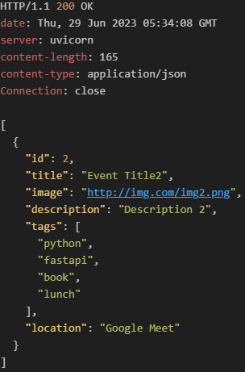 |

<br/>