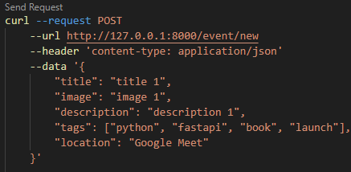
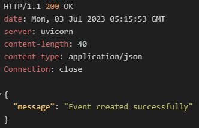
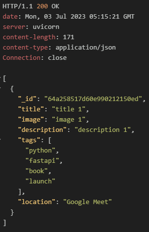
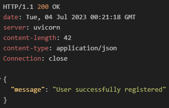
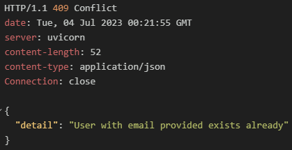
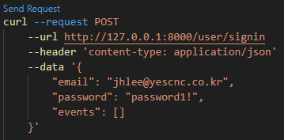
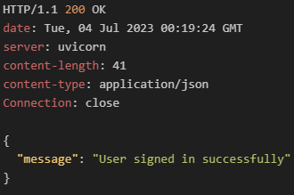

# 5. CRUD 처리
- connection.py 파일을 수정한다. 라이브러리 및 Database 클래스를 아래와 같이 추가한다.
###### /database/connection.py
```python
from pydantic import BaseModel
from typing import Any, List
from beanie import PydanticObjectId


class Database:
    def __init__(self, model):
        self.model = model
```

<br/>

#### 5.1 생성 처리
- Database클래스 안에 save() 메서드를 추가한다. 이 메서드는 레코드 하나를 데이터베이스 컬렉션에 추가한다.
    ##### /database/connection.py
    ```python
    # 레코드 생성
    async def save(self, document) -> None:
        await document.create()
        return
    ```

<br/>

#### 5.2 조회 처리
- 단일 레코드를 불러오거나 전체 레코드를 불러오는 메서드 작성
    ##### /database/connection.py
    ```python
    # 단일 레코드 조회
    async def get(self, id: PydanticObjectId) -> Any:
        doc = await self.model.get(id)
        if doc:
            return doc
        return False
    
    # 전체 레코드 조회
    async def get_all(self) -> List[Any]:
        docs = await self.model.find_all().to_list()
        return docs
    ```

<br/>

#### 5.3 변경 처리
- 기존 레코드 변경
- 하나의 ID와 pydantic 스키마를 인수로받는다.
- 스키마에는 클라이언트가 보낸 PUT요청에 의해 변경된 필드가 저장된다.
    ##### /database/connection.py
    ```python
    # 레코드 변경
    async def update(self, id: PydanticObjectId, body: BaseModel) -> Any:
        doc_id = id
        des_body = body.dict()
        des_body = {k:v for k,v in des_body in des_body.items() if v is not None}
        update_query = {"$set": {
            field: value for field, value in des_body.items()
        }}

        doc = await self.get(doc_id)
        if not doc:
            return False
        await doc.update(update_query)
        return doc
    ```

<br/>

#### 5.4 삭제 처리
- 기존 레코드 삭제
- 해당 레코드가 존재하는지 확인 후 삭제

    ##### /database/connection.py
    ```python
    # 레코드 삭제
    async def delete(self, id: PydanticObjectId) -> bool:
        doc = await self.get(id)
        if not doc:
            return False
        await doc.delete()
        return True
    ```

<br/>

#### 5.5 route변경
- 기존 route를 MongoDB를 사용하도록 변경
##### 5.5.1 이벤트 route 변경
###### /routes/events.py
```python
from beanie import PydanticObjectId
from fastapi import APIRouter, Body, HTTPException, status
from ..database.connection import Database
from ..models.events import Event, EventUpdate
from typing import List

event_database = Database(Event)
event_router = APIRouter(tags=["Events"])
events = []


# 모든 이벤트 조회
@event_router.get("/", response_model=List[Event])
async def retrieve_all_events() -> List[Event]:
    events = await event_database.get_all()
    return events


# 특정 이벤트 조회
@event_router.get("/{id}", response_model=Event)
async def retrieve_event(id: PydanticObjectId) -> Event:
    event = await event_database.get(id)
    if not event:
        raise HTTPException(
            status_code=status.HTTP_404_NOT_FOUND,
            detail="Event with supplied ID does not exist",
        )
    return event


# 이벤트 생성
@event_router.post("/new")
async def create_event(body: Event = Body(...)) -> dict:
    await event_database.save(body)
    return {"message": "Event created successfully"}


# 이벤트 삭제
@event_router.delete("/{id}")
async def delete_event(id: PydanticObjectId) -> dict:
    event = await event_database.delete(id)
    if not event:
        raise HTTPException(
            status_code=status.HTTP_404_NOT_FOUND,
            detail="Event with supplied ID does not exist",
        )
    return {
        "message": "event deleted successfully"
    }


# 이벤트 수정
@event_router.put("/{id}}", response_model=Event)
async def update_event(id: PydanticObjectId, body: EventUpdate) -> Event:
    updated_event = await event_database.update(id, body)
    if not update_event:
        raise HTTPException(
            status_code=status.HTTP_404_NOT_FOUND,
            detail="Event with supplied ID does not exist"
        )
    return updated_event
```

<br/>

##### 5.5.2 사용자 route 변경
###### /routes/users.py
```python
from fastapi import APIRouter, HTTPException, status
from ..database.connection import Database
from ..models.users import User, UserSignIn

user_router = APIRouter(
    tags=["User"],
)
users = {}
user_database = Database(User)


# 사용자 등록
@user_router.post("/signup")
async def sign_new_user(user: User) -> dict:
    user_exist = await User.find_one(User.email == user.email)
    if user_exist:
        raise HTTPException(
            status_code=status.HTTP_409_CONFLICT,
            detail="User with email provided exists already",
        )
    await user_database.save(user)
    return {"message": "User successfully registered"}


# 사용자 로그인
@user_router.post("/signin")
async def sign_user_in(user: UserSignIn) -> dict:
    user_exist = await User.find_one(User.email == user.email)

    if not user_exist:
        raise HTTPException(
            status_code=status.HTTP_404_NOT_FOUND, detail="User does not exist"
        )

    if user_exist.password == user.password:
        return {"message": "User signed in successfully"}

    raise HTTPException(
        status_code=status.HTTP_403_FORBIDDEN, detail="Wrong credentials passed"
    )
```

<br/>

##### 5.5.3 main 변경
###### /main.py
```python
from fastapi import FastAPI
from .database.connection import Settings
from .routes.users import user_router
from .routes.events import event_router


app = FastAPI()
settings = Settings()

# 라우트 등록
app.include_router(user_router, prefix="/user")
app.include_router(event_router, prefix="/event")


@app.on_event("startup")
async def init_db():
    await settings.initialize_database()
```

<br/>

##### 5.5.4 기타 설정
- .env 파일을 사용하기 위해 dotenv 라이브러리 설치
    > (venv)$ pip install pydantic[dotenv]

- .env파일 경로 인식이 안된다면 아래 코드 추가
    ###### /database/connection.py
    ```python
    from pathlib import Path
    from dotenv import load_dotenv

    env_path = Path(__file__).resolve().parent.parent / ".env"
    load_dotenv(env_path)
    ```

<br/>

#### 5.6 이벤트 요청 및 응답 확인
|                               | 요청                                                                        | 응답                                  |
| ----------------------------- | --------------------------------------------------------------------------- | ------------------------------------- |
| 생성 &nbsp;&nbsp;&nbsp;&nbsp; |                                        |  |
| 전체조회 / 조회               |   |   |
| 수정                          |                                        |  |
| 삭제                          |                                        |  |


#### 5.7 사용자 요청 및 응답 확인
|                      | 요청                                   | 응답                                   |
| -------------------- | -------------------------------------- | -------------------------------------- |
| 생성                 |  |  |
| 중복생성 시도할 경우 |  |  |
| 로그인               |   |  |