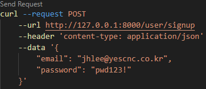
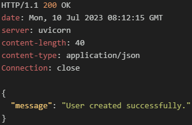
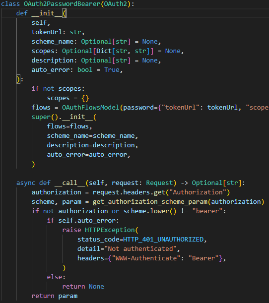

# 2. OAuth2와 JWT를 사용한 애플리케이션 보안

###### 인증 흐름


#### 2.1 인증 기능 구조화
- 이벤트플래너 애플리케이션에 인증 기능을 추가하기 위해 폴더 및 파일추가

      planner/
          auth/
            jwt_handler.py
            authenticate.py
            hash_password.py
  - jwt_handler.py : JWT문자열을 인코딩 또는 디코딩 하여 토큰을 생성하거나 검증 
  - authenticate.py : 인증 및 권한을 위해 라우트에 주입되는 의존 라이브러리
  - hash_password.py : 패스워드를 암호화하는 함수가 포함된다. 계정을 등록하거나 로그인 시 패스워드 비교에 사용됨

#### 2.2 패스워드 해싱
- 데이터베이스 연결에서 사용자 패스워드를 일반텍스트로 저장했었는데 bcrypt를 사용해 암호화 해보자.

> 💡 bcrypt란?  
> 
>  bcrypt는 비밀번호를 해싱하는데 사용하는 함수이다.  
>  해싱이란 입력으로 받은 데이터를 고정된 길이의 해시 값으로 변환하는 알고리즘을 말한다.

<br/>

##### 2.2.1 passlib 라이브러리 설치
> (venv)$ pip install passlib[bcrypt]

<br/>

##### 2.2.2 패스워드를 해싱하는 함수 작성

###### /auth/hash_password.py
```python
from passlib.context import CryptContext

pwd_context = CryptContext(schemes=["bcrypt"], deprecated="auto")


class HashPassword:
    """패스워드 해싱 함수. bcrypt를 사용하여 해싱
    - create_hash(): 문자열로 된 패스워드를 bcrypt로 해싱한 후 해싱된 문자열 return
    - verify_hash(): 해싱되기 전 문자열과 해싱된 후의 문자열을 입력받아 같은 값인지 비교하여 T/F여부 return
    """

    def create_hash(self, password: str):
        return pwd_context.hash(password)

    def verify_hash(self, plain_password: str, hashed_password: str):
        return pwd_context.verify(plain_password, hashed_password)
```
  
<br/>

##### 2.2.3 패스워드값을 해싱한 값으로 저장하도록 사용자등록 함수 변경

###### /routes/users.py
```python
from fastapi import APIRouter, HTTPException, status, Depends
from sqlmodel import select

from ..auth.hash_password import HashPassword
from ..database.connection import get_session
from ..models.users import User, UserSignIn


user_router = APIRouter(
    tags=["User"],
)
hash_password = HashPassword()


@user_router.post("/signup")
async def sign_new_user(new_user: User, session=Depends(get_session)) -> dict:
    """사용자 등록"""

    # 등록된 사용자인지 체크
    select_user_exist = select(User).where(User.email == new_user.email)
    results = session.exec(select_user_exist)
    user_exist = results.first()

    # 이미 등록된 사용자면 HTTPException 발생
    if user_exist:
        raise HTTPException(
            status_code=status.HTTP_409_CONFLICT,
            detail="해당 이메일은 이미 등록된 사용자입니다.",
        )

    # 등록된 사용자가 아니면 INSERT
    hashed_password = hash_password.create_hash(new_user.password)
    new_user.password = hashed_password
    session.add(new_user)
    session.commit()
    session.refresh(new_user)
    return {"message": "사용자가 등록되었습니다."}
```

<br/>

##### 2.2.4 해싱된 패스워드값으로 DB에 저장되는지 테스트

###### 사용자등록 실행 및 결과 확인
| 요청                                  | 결과                                  |
| ------------------------------------- | ------------------------------------- |
|   |  |
|  |  |

<br/>
<br/>

#### 2.3 액세스 토큰 생성과 검증
- JWT를 이용하여 액세스 토큰을 구현하면 애플리케이션의 보안을 한 단계 더 강화할 수 있다.
 
> 💡 토큰이란?  
> - 보안과 인증을 위해 사용되는 문자열로, 주로 클라이언트가 자원에 접근할 때 신원을 증명하거나 권한을 부여하는데 사용된다.
> - 서버에서 발급되고 클라이언트에게 전달된다. 클라이언트는 이 토큰을 사용하여 인증된 요청을 보낼 수 있고 서버는 토큰을 검증하여 요청을 승인할 수 있다.


###### JWT 토큰의 세가지 구성요소
| 헤더(Header)                                        | 페이로드(Payload)                                                                                                             | 서명(Signature)                                                                    |
| --------------------------------------------------- | ----------------------------------------------------------------------------------------------------------------------------- | ---------------------------------------------------------------------------------- |
| 토큰의 타입과 암호화 알고리즘을 지정하는 메타데이터 | 토큰에 포함되는 클레임 정보가 포함된다. 클레임은 토큰의 내용에 대한 정보를 포함한다. 예를들어 사용자ID, 권한, 토큰만료시간 등 | 토큰의 유효성을 검증하기 위해 사용되고 헤더와 페이로드,비밀키를 사용하여 생성된다. |

<br/>

##### 2.3.1 JWT인코딩, 디코딩용 jose 라이브러리 설치
> pip install python-jose[cryptography] python-multipart

<br/>

##### 2.3.2 SECRET_KEY 작성 및 사용
- SECRET_KEY는 보안 및 관리를 위해 코드에 직접 입력하지 않고 별도의 파일인 .env에서  작성하고 사용하도록 한다.

<br/>

###### .env

```
DATABSE_CONNECTION_STRING=sqlite:///planner.db
SECRET_KEY=HI5HL3V3L$3CR3T
```

<br/>

###### /database/connection.py
```python
from pathlib import Path
from dotenv import load_dotenv

env_path = Path(__file__).resolve().parent.parent / ".env"
load_dotenv(env_path)


class Settings(BaseSettings):
    """환경변수 관리 클래스"""

    DATABSE_CONNECTION_STRING: str = None
    SECRET_KEY: Optional[str] = None

    class Config:
        env_file = ".env"


settings = Settings()
connect_args = {"check_same_thread": False}
engine_url = create_engine(
    settings.DATABSE_CONNECTION_STRING, echo=True, connect_args=connect_args
)


def conn():
    """create_all()실행. DB 및 테이블 스키마 생성"""
    SQLModel.metadata.create_all(engine_url)


def get_session():
    """세션 관리"""
    with Session(engine_url) as session:
        yield session
```

<br/>

##### 2.3.3 jwt_handler파일 작성

###### /auth/jwt_handler.py
```python
import time
from datetime import datetime

from fastapi import HTTPException, status
from jose import jwt, JWTError
from ..database.connection import Settings

settings = Settings()


def create_access_token(user: str):
    """토큰 생성 함수
    인증에 성공한 사용자에게 발행할 토큰을 생성.
    사용자명(이메일)과 만료일로 payload를 구성하고 시크릿키와 명시된 알고리즘으로
    인코딩하여 토큰을 생성한다.
    """
    payload = {"user": user, "expires": time.time() + 3600}

    token = jwt.encode(payload, settings.SECRET_KEY, algorithm="HS256")
    return token


def verify_access_token(token: str):
    """토큰 검증 함수
    토큰을 입력받아 디코딩한 후 만료일을 체크하여
    유효한 토큰인지 검증한다.
    """
    try:
        data = jwt.decode(token, settings.SECRET_KEY, algorithms=["HS256"])
        expire = data.get("expires")

        if expire is None:
            raise HTTPException(
                status_code=status.HTTP_400_BAD_REQUEST,
                detail="액세스 토큰이 존재하지 않습니다.",
            )
        if datetime.utcnow() > datetime.utcfromtimestamp(expire):
            raise HTTPException(
                status_code=status.HTTP_403_FORBIDDEN, detail="토큰이 만료되었습니다."
            )
        return data

    except JWTError:
        raise HTTPException(
            status_code=status.HTTP_400_BAD_REQUEST, detail="토큰정보가 잘못되었습니다."
        )

```

#### 2.4 사용자 인증
- 이벤트 라우트에 주입할 의존 라이브러리를 생성

```python
from fastapi import Depends, HTTPException, status
from fastapi.security import OAuth2PasswordBearer

from .jwt_handler import verify_access_token

oauth2_scheme = OAuth2PasswordBearer(tokenUrl="/user/signin")


async def authenticate(token: str = Depends(oauth2_scheme)) -> str:
    """ 인증이 필요한 라우트에 의존성 주입을 통해 인증요구를 
    검증된 토큰의 사용자명을 return
    """
    if not token:
        raise HTTPException(
            status_code=status.HTTP_403_FORBIDDEN, detail="해당 기능을 이용하려면 로그인이 필요합니다."
        )

    decoded_token = verify_access_token(token)
    return decoded_token["user"]
```

<br/>

  - #### OAuth2PasswordBearer 클래스      
      - OAuth2PasswordBearer클래스의 __init__() 은 oauth2_scheme인스턴스 생성 시에 한번만 실행되고 oauth2_scheme를 의존성 주입 받은 authenticate()함수가 호출될 때는 __call__()이 실행된다. 
       
      - __call__()함수는 request의 Authorization 헤더에서 토큰을 추출하여 반환하는 역할을 한다. Bearer스키마를 사용하지 않거나 액세스 토큰이 없는 경우 HTTPException을 발생시킨다.
       
      - Swagger와 Redoc은 Depends()를 사용해 의존성 주입받은 라우팅 함수가 액세스 토큰을 추출하고 검증하는 함수인 경우 해당 함수를 인증이 필요한 함수로 처리한다.
  
