# 3. 이벤트플래너 애플리케이션에 인증모델 적용

#### 3.1 로그인 라우트 변경
- OAuth2PasswordRequestForm 클래스를 sign_user_in() 라우트 함수에 주입하여 사용
- x-www-form-urlencoded 타입으로 요청하고 json타입으로 응답

<br/>

##### 3.1.1 로그인 라우팅함수 변경

###### /routes/users.py
```python
from fastapi import APIRouter, Depends, HTTPException, status
from fastapi.security import OAuth2PasswordRequestForm

from ..auth.jwt_handler import create_access_token


@user_router.post("/signin", response_model=TokenResponse)
async def sign_user_in(
    user: OAuth2PasswordRequestForm = Depends(), session=Depends(get_session)
) -> dict:
    """사용자 로그인"""

    # DB에 존재하는 이메일 정보 가져옴
    select_user_exist = select(User).where(User.email == user.username)
    results = session.exec(select_user_exist)
    user_exist = results.first()

    # 존재 하지 않는다면 HTTPException
    if not user_exist:
        raise HTTPException(
            status_code=status.HTTP_404_NOT_FOUND, detail="해당 이메일은 존재하지 않습니다."
        )

    # 패스워드가 일치하는지 인증정보 비교 후 인증에 성공하면 토큰 발행
    if hash_password.verify_hash(user.password, user_exist.password):
        access_token = create_access_token(user_exist.email)
        return {"access_token": access_token, "token_type": "Bearer"}

    # 패스워드 불일치 또는 기타 Exception 발생
    raise HTTPException(
        status_code=status.HTTP_401_UNAUTHORIZED, detail="패스워드가 일치하지 않거나 알 수 없는 오류가 발생했습니다."
    )
```

<br/>

##### 3.1.2 OAuth2PasswordRequestForm 클래스

###### /fastapi/security/oauth2.py
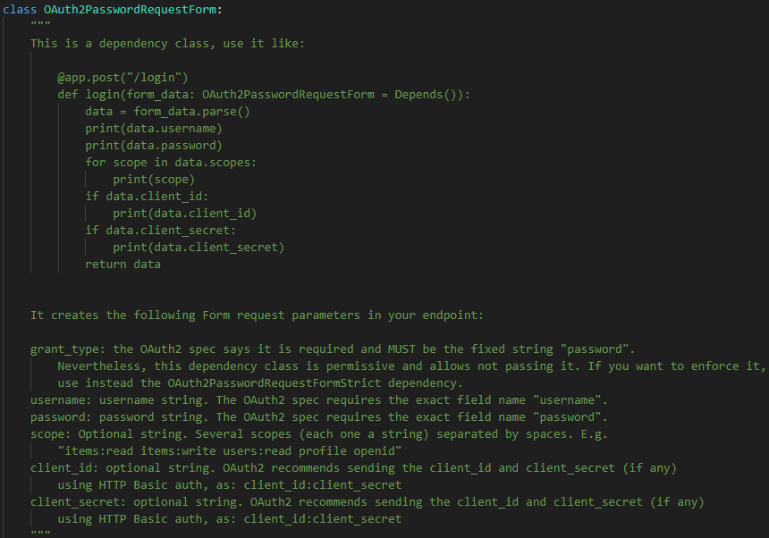

| 파라미터명               | 설명                                                                                                                                                                                                                                                                                                                                                                                                                                        |
| ------------------------ | ------------------------------------------------------------------------------------------------------------------------------------------------------------------------------------------------------------------------------------------------------------------------------------------------------------------------------------------------------------------------------------------------------------------------------------------- |
| grant_type               | 인증방식을 선택하는데 사용된다. OAuth2.O 스펙에 따르면 이 값은  OAuth 2.0 인증 프로토콜에서 반드시 포함되어야 하는 필수 필드이다. 하지만 FastAPI의 OAuth2PasswordRequestForm클래스는 유연성을 제공하기 위해 grant_type필드가 포함되지 않았거나 값이 없는경우에도 사용할 수 있도록 만들어졌다. 명시하지 않는 경우 해당 필드엔 None값이 할당된다. 만약 grant_type을 강제로 요구하도록 하려면 OAuth2PasswordRequestFormStrict를 사용하면 된다. |
| username, password       | 인증에 사용                                                                                                                                                                                                                                                                                                                                                                                                                                 |
| scope                    | 인증된 사용자가 엑세스할 수 있는 권한의 범위를 지정하는데 사용하며 서비스 제공자가 정의한다. (예시: read, write, read write, ...)                                                                                                                                                                                                                                                                                                           |
| client_id, client_secret | 클라이언트 인증을 위해 사용. 클라이언트를 식별하고, 클라이언트의 인증정보를 검증하는데 사용된다.                                                                                                                                                                                                                                                                                                                                            |

<br/>

##### 3.1.3 요청바디가 OAuth2 사양를 따르는지 Swagger에서 확인


<br/>

💡Swagger,Redoc에서 request body가 form형식으로 생성되는 이유는?
> 요청타입인 "application-x-www-form-urlencoded"는 OAuth2 프로토콜에서 권장하는 표준 요청 타입으로써 FastAPI에서 구현한 OAuth2PasswordRequestForm클래스는 application-x-www-form-urlencoded타입을 기본값으로 사용한다.
>  
> 로그인 라우팅 함수에 OAuth2PasswordRequestForm클래스를 의존성 주입하여 사용하고 있고 OAuth2PasswordRequestFrom클래스는 Form클래스를 사용한다.
> 
> Form클래스는  media_type 매개변수에 기본값으로 "application/x-www-form-urlencoded"를 할당하고 있으며 Swagger나 Redoc은 이 Form클래스의 media_type값에 정의된 Content-type으로 문서를 생성한다.


<br/>

| 위치       | 내용                                  |
| ---------- | ------------------------------------- |
| def Form() |  |
| class Form |  |

<br/>

###### Form클래스의 media_type 값을 application/json으로 변경하고 확인한결과 

| 클래스                                                                                                                                                                                                                                                                                                    | Swagger UI                             |
| --------------------------------------------------------------------------------------------------------------------------------------------------------------------------------------------------------------------------------------------------------------------------------------------------------- | -------------------------------------- |
| 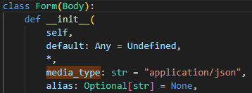 &nbsp;&nbsp;&nbsp;&nbsp;&nbsp;&nbsp;&nbsp;&nbsp;&nbsp;&nbsp;&nbsp;&nbsp;&nbsp;&nbsp;&nbsp;&nbsp;&nbsp;&nbsp;&nbsp;&nbsp;&nbsp;&nbsp;&nbsp;&nbsp;&nbsp;&nbsp;&nbsp;&nbsp;&nbsp;&nbsp;&nbsp;&nbsp;&nbsp;&nbsp;&nbsp;&nbsp;&nbsp;&nbsp;&nbsp;&nbsp;&nbsp;&nbsp;&nbsp; |  |

<br/>
<br/>

##### 3.1.4 라우트 동작 테스트
| 요청                                  | 응답                                  |
| ------------------------------------- | ------------------------------------- |
|  |  |

<br/>
<br/>

#### 3.2 이벤트 라우트 변경
- 인증된 사용자만이 이벤트를 변경,수정,삭제할 수 있도록 코드 변경
- POST, PUT, DELETE 라우트 함수에 인증정보 의존성 주입

<br/>

##### 3.2.1 이벤트 라우팅함수에 authenticate 의존성 주입하여 인증된 사용자만 사용할 수 있도록 변경 (라우팅요청시 토큰요구)
```python
@event_router.post("/new")
async def create_event(
    body: Event,
    user: str = Depends(authenticate),
    session=Depends(get_session),
) -> dict:
    """이벤트 생성"""
    session.add(body)
    session.commit()
    session.refresh(body)

    return {"메시지": "이벤트가 생성되었습니다."}


@event_router.put("/{id}", response_model=Event)
async def update_event(
    body: EventUpdate,
    id: int = Path(
        ...,
        title="이벤트 ID",
        description="이벤트마다 부여되는 고유식별자, PK, 자동증가값",
    ),
    user: str = Depends(authenticate),
    session=Depends(get_session),
) -> Event:
    """이벤트 변경"""
    event = session.get(Event, id)
    if event:
        event_data = body.dict(exclude_unset=True)
        for key, value in event_data.items():
            setattr(event, key, value)
        session.add(event)
        session.commit()
        session.refresh(event)

        return event
    raise HTTPException(
        status_code=status.HTTP_404_NOT_FOUND,
        detail="제공된 ID에 해당하는 이벤트가 없습니다.",
    )


@event_router.delete("/{id}")
async def delete_event(
    id: int = Path(
        ...,
        title="이벤트 ID",
        description="이벤트마다 부여되는 고유식별자, PK, 자동증가값",
    ),
    user: str = Depends(authenticate),
    session=Depends(get_session),
) -> dict:
    """이벤트 삭제"""
    event = session.get(Event, id)
    if event:
        session.delete(event)
        session.commit()
        return {"메시지": "이벤트가 정상적으로 삭제되었습니다."}

    raise HTTPException(
        status_code=status.HTTP_404_NOT_FOUND,
        detail="제공된 ID에 해당하는 이벤트가 없습니다.",
    )
```

| 변경전                                | 변경후                                |
| ------------------------------------- | ------------------------------------- |
| 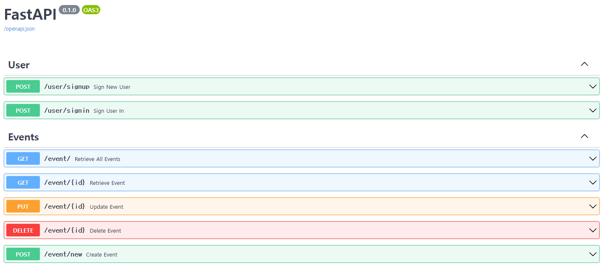 | 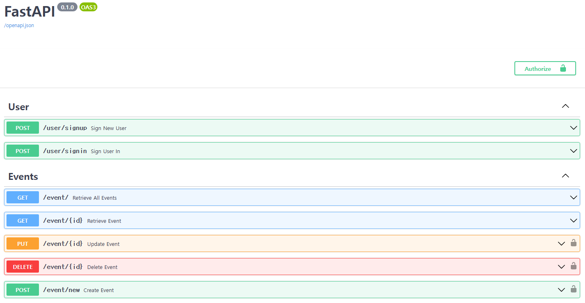 |

<br/>

##### 3.2.2 로그인하여 허가 받은 후 이벤트 생성,수정,삭제

###### 3.2.2.1 이벤트 생성

| 요청                                   | 응답                                   |
| -------------------------------------- | -------------------------------------- |
| 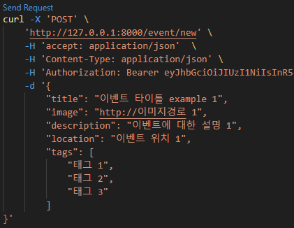 |  |

<br/>

###### 3.2.2.2 이벤트 수정

| 요청                                   | 응답                                   |
| -------------------------------------- | -------------------------------------- |
| 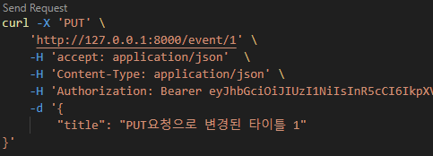 | 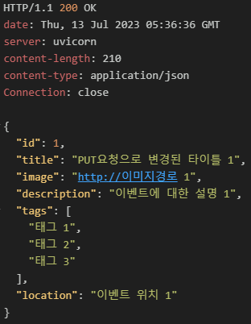 |

<br/>

###### 3.2.2.3 이벤트 삭제

| 요청                                   | 응답                                   |
| -------------------------------------- | -------------------------------------- |
|  | 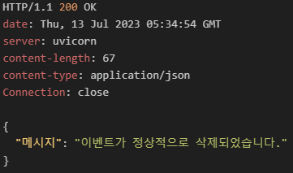 |

<br/>

#### 3.3 사용자별 이벤트 처리 수정
- POST 라우트: 생성된 이벤트를 사용자가 소유한 이벤트 목록에 추가한다.
- UPDATE 라우트: 사용자가 만든 이벤트만 변경할 수 있게 한다.
- DELETE 라우트: 사용자가 만든 이벤트만 삭제할 수 있게 한다.

###### 3.3.1 이벤트모델 수정
```python
class Event(SQLModel, table=True):
    creator: Optional[str]
```

###### 3.3.2 이벤트생성 라우트 수정
```python
@event_router.post("/new")
async def create_event(
    body: Event,
    user: str = Depends(authenticate),
    session=Depends(get_session),
) -> dict:
    """이벤트 생성"""
    body.creator = user
    session.add(body)
    session.commit()
    session.refresh(body)

    return {"메시지": "이벤트가 생성되었습니다."}
```

<br/>

###### 이벤트생성 라우트 수정 후 테스트

|            | 요청                                   | 응답                                   |
| ---------- | -------------------------------------- | -------------------------------------- |
| 이벤트생성 | 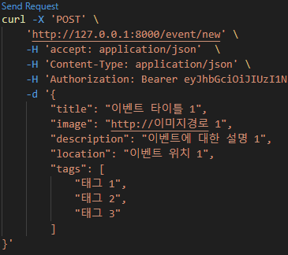 | 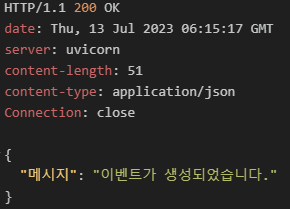 |
| 이벤트조회 |  | 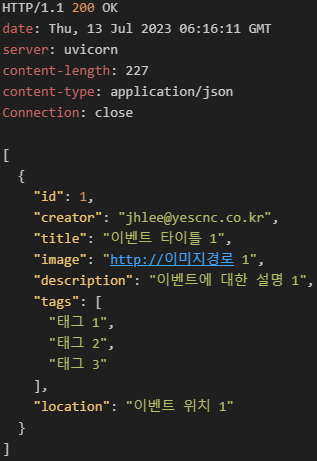 |

<br/>

###### 3.3.3 이벤트변경 라우트 수정
```python
@event_router.put("/{id}", response_model=Event)
async def update_event(
    body: EventUpdate,
    id: int = Path(
        ...,
        title="이벤트 ID",
        description="이벤트마다 부여되는 고유식별자, PK, 자동증가값",
    ),
    user: str = Depends(authenticate),
    session=Depends(get_session),
) -> Event:
    """이벤트 변경"""
    event = session.get(Event, id)
    
    if event:
        # 로그인된 사용자가 만든 이벤트인지 확인
        if event.creator != user:
            raise HTTPException(
                status_code=status.HTTP_400_BAD_REQUEST,
                detail="자신이 생성한 이벤트만 수정할 수 있습니다.",
            )

        # 본인이 만든 이벤트가 맞다면 수정 실행
        event_data = body.dict(exclude_unset=True)
        for key, value in event_data.items():
            setattr(event, key, value)
        session.add(event)
        session.commit()
        session.refresh(event)

        return event

    # 이벤트가 존재하지 않으면 HTTPException
    raise HTTPException(
        status_code=status.HTTP_404_NOT_FOUND,
        detail="제공된 ID에 해당하는 이벤트가 없습니다.",
    )
```

<br/>

###### 이벤트변경 라우트 수정  후 테스트
- 테스트를 위해 사용자 및 이벤트를 DB상에 아래와 같이 생성한다.
  
    
|                              | jhlee@yescnc.co.kr                     | guest@yescnc.co.kr                     |
| ---------------------------- | -------------------------------------- | -------------------------------------- |
| 1.사용자생성                 | 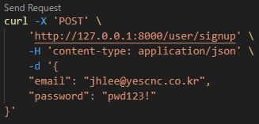 | 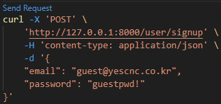 | \ |
| 2.로그인하여 토큰발급        |  |  |
| 3.발급된 토큰으로 이벤트생성 | 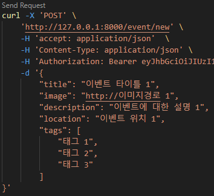 |  |
| 4.생성된 이벤트리스트 확인   | 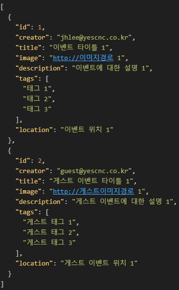 |

<br/>

case 1. 본인이 생성한 이벤트가 아닌 경우

|                           | 요청                                   | 응답                                   |
| ------------------------- | -------------------------------------- | -------------------------------------- |
| guest계정 토큰발행        |  |  |
| jhlee계정 이벤트 수정시도 | 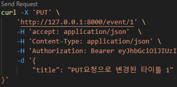 |  |

<br/>

case 2. 본인이 생성한 이벤트인 경우

|                           | 요청                                   | 응답                                   |
| ------------------------- | -------------------------------------- | -------------------------------------- |
| jhlee계정 토큰발행        |  | 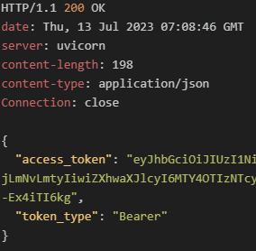 |
| jhlee계정 이벤트 수정시도 | 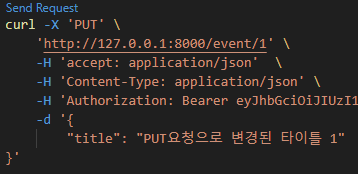 |  |


<br/>

###### 3.3.4 이벤트삭제 라우트 수정
```python
@event_router.delete("/{id}")
async def delete_event(
    id: int = Path(
        ...,
        title="이벤트 ID",
        description="이벤트마다 부여되는 고유식별자, PK, 자동증가값",
    ),
    user: str = Depends(authenticate),
    session=Depends(get_session),
) -> dict:
    """이벤트 삭제"""
    event = session.get(Event, id)

    if event:
        # 로그인된 사용자가 만든 이벤트인지 확인
        if event.creator != user:
            raise HTTPException(
                status_code=status.HTTP_404_NOT_FOUND,
                detail="자신이 생성한 이벤트만 삭제할 수 있습니다.",
            )
        
        # 본인이 만든 이벤트가 맞다면 삭제 실행
        session.delete(event)
        session.commit()
        return {"메시지": "이벤트가 정상적으로 삭제되었습니다."}

    # 이벤트가 존재하지 않으면 HTTPException
    raise HTTPException(
        status_code=status.HTTP_404_NOT_FOUND,
        detail="제공된 ID에 해당하는 이벤트가 없습니다.",
    )
```
<br/>

###### 이벤트삭제 라우트 수정 후 테스트


case 1. 본인이 생성한 이벤트가 아닌 경우

|                                    | 요청                                   | 응답                                   |
| ---------------------------------- | -------------------------------------- | -------------------------------------- |
| guest계정에서 jhlee이벤트 삭제시도 | 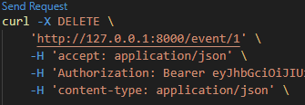 |  |

<br/>

case 2. 본인이 생성한 이벤트인 경우

|                                    | 요청                                   | 응답                                   |
| ---------------------------------- | -------------------------------------- | -------------------------------------- |
| guest계정에서 guest이벤트 삭제시도 |  | 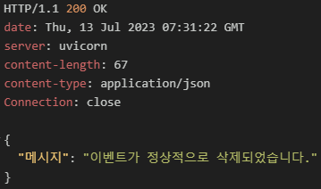 |

<br/>